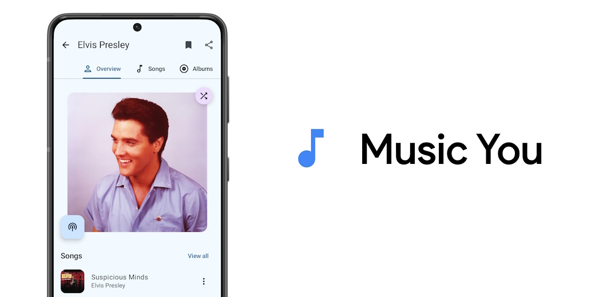

  

<h1 align="center">🎵 Symphony</h1>

  <em>An elegant Android application for streaming music from YouTube Music.</em>

---

## ✨ Features

- **Background Playback**: Seamlessly listen to music while using other apps.
- **Offline Mode**: Cache your favorite songs for playback without an internet connection.
- **Comprehensive Search**: Easily find songs, albums, artists, videos, and playlists.
- **Library Management**: Bookmark artists, albums, import playlists, and manage your local collections.
- **Lyrics Support**: Fetch, display, and even edit synchronized or standard lyrics for your songs.
- **Smart Link Handling**: Automatically open YouTube and YouTube Music links within the app.
- **Advanced Player Controls**: Enjoy features like a sleep timer, persistent queue, skip silence, and audio normalization.
- **Seamless Integrations**: Built-in Android Auto support and an invincible service for uninterrupted listening.

### 🗒️ What's New

- **Material You Redesign**: A modern, fluid interface that adapts to your device's theme.
- **Multilingual Support**: Enjoy the app in multiple languages.
- **Customizable Quick Picks**: Tailor your home screen selections to your taste.
- **Intuitive Gestures**: Swipe to enqueue or delete songs effortlessly.

## 🌍 Available Languages

- English
- Spanish
- German ([@siggi1984](https://github.com/siggi1984))
- French ([@patxixi](https://github.com/patxixi) and [@Mickael81](https://github.com/Mickael81))
- Italian ([@F3FFO](https://github.com/F3FFO))

## 📸 Screenshots

  
  
  

  
  
  

## 🤝 Community & Support

Have an idea or found a bug? Feel free to open an issue or submit a pull request! We welcome contributions from developers and designers alike to help make Symphony even better.

## ℹ️ Disclaimer

This project and its contents are not affiliated with, funded, authorized, endorsed by, or in any way associated with YouTube, Google LLC or any of its affiliates and subsidiaries.

Any trademark, service mark, trade name, or other intellectual property rights used in this project are owned by the respective owners.
