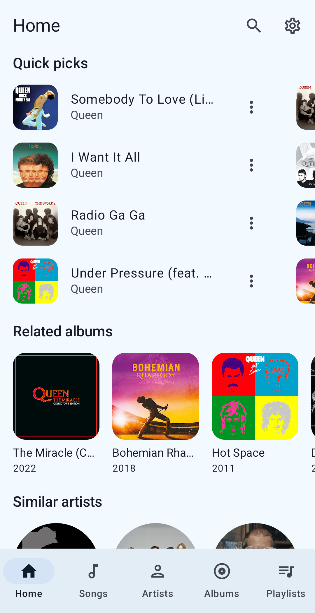
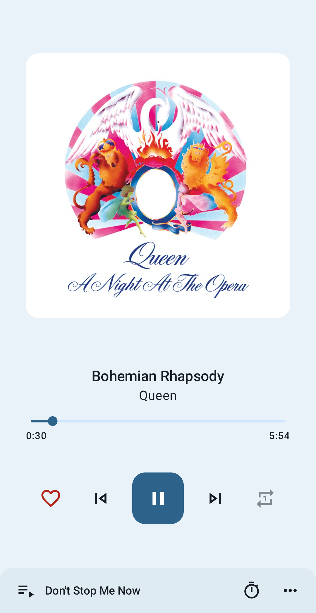
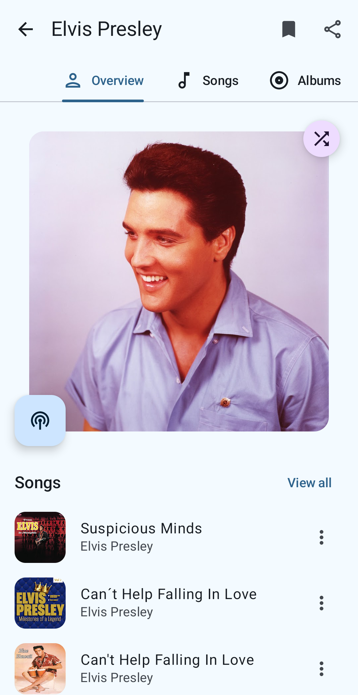
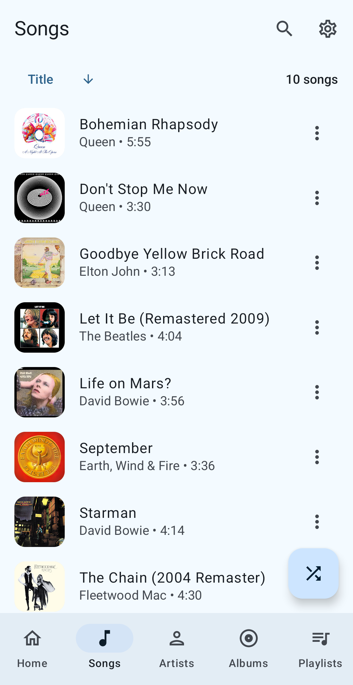
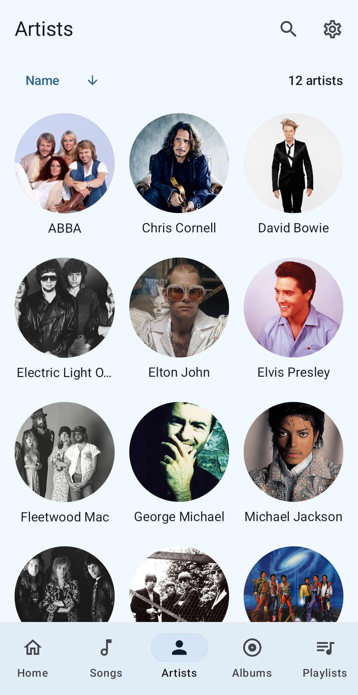
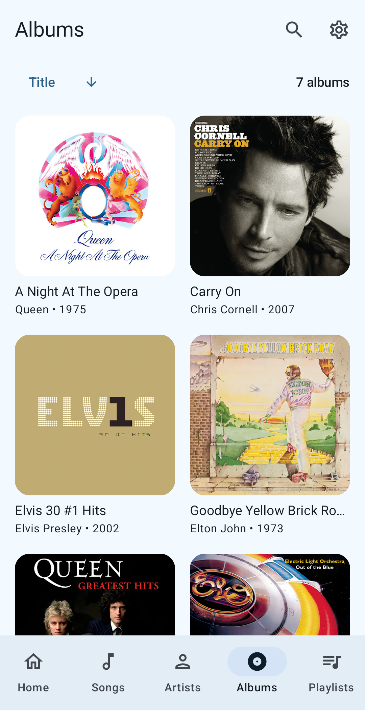

# Symphony

### Your music. Your way. Perfectly in tune.

**A beautiful, feature-rich Android music streaming app powered by YouTube Music**

 

 

[**Download**](#-installation) · [**Features**](#-features) · [**Screenshots**](#-screenshots) · [**Languages**](#-available-languages)

---

 

## ✨ Features

<table>
<tr>
<td width="50%">

### 🎵 Playback
- **Background playback** — music keeps playing while you do other things
- **Offline caching** — save songs for listening without internet
- **Sleep timer** — drift off to your favorite tunes
- **Persistent queue** — your queue survives app restarts
- **Skip silence** — no more awkward dead air
- **Audio normalization** — consistent volume across tracks

</td>
<td width="50%">

### 🔍 Discovery
- **Universal search** — find songs, albums, artists, videos & playlists
- **Bookmark artists & albums** — keep your favorites close
- **Import & manage playlists** — bring your existing lists in
- **Quick picks customization** — tailor your home feed your way
- **YouTube Music links** — open links directly in Symphony

</td>
</tr>
<tr>
<td width="50%">

### 🎤 Lyrics
- **Fetch & display lyrics** — never miss a word
- **Synchronized lyrics** — follow along line by line
- **Edit lyrics** — fix and personalize as you like

</td>
<td width="50%">

### 📱 Experience
- **Material You design** — adapts to your wallpaper colors
- **Android Auto support** — full control on the road
- **Multilingual** — available in 5+ languages
- **Swipe to enqueue / delete** — intuitive gesture controls
- **Invincible service** — music never stops unexpectedly

</td>
</tr>
</table>

 

---

## 📸 Screenshots

<table>
<tr>
<td align="center" width="33%">

 <b>🏠 Home</b>
</td>
<td align="center" width="33%">

 <b>🎶 Player</b>
</td>
<td align="center" width="33%">

 <b>🎤 Artist</b>
</td>
</tr>
<tr>
<td align="center" width="33%">

 <b>🎵 Songs</b>
</td>
<td align="center" width="33%">

 <b>👥 Artists</b>
</td>
<td align="center" width="33%">

 <b>💿 Albums</b>
</td>
</tr>
</table>

 

---

## 📲 Installation

> **Requirements:** Android 6.0 (Marshmallow) or higher

 

---

## 🌐 Available Languages

| Language | Contributor |
|----------|-------------|
| 🇬🇧 English | Built-in |
| 🇪🇸 Spanish | Built-in |
| 🇩🇪 German | [@siggi1984](https://github.com/siggi1984) |
| 🇫🇷 French | [@patxixi](https://github.com/patxixi) & [@Mickael81](https://github.com/Mickael81) |
| 🇮🇹 Italian | [@F3FFO](https://github.com/F3FFO) |

*Want to add your language? Contributions are welcome!*

 

---

## 🌟 Acknowledgements

Symphony stands on the shoulders of giants. Inspired by these incredible projects:

 

---

## ⚖️ Disclaimer

> This project and its contents are **not affiliated with, funded, authorized, endorsed by, or in any way associated** with YouTube, Google LLC or any of its affiliates and subsidiaries.
>
> Any trademark, service mark, trade name, or other intellectual property rights used in this project are owned by the respective owners.

 

---

**Made with ❤️ for music lovers everywhere**

*Symphony — where every beat finds its place*

